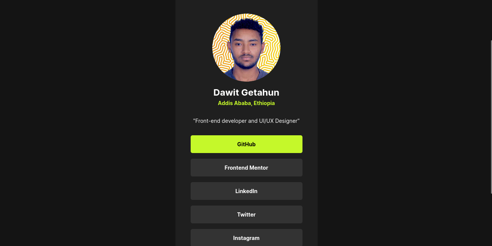

# Frontend Mentor - Social links profile solution

This is a solution to the [Social links profile challenge on Frontend Mentor](https://www.frontendmentor.io/challenges/social-links-profile-UG32l9m6dQ). Frontend Mentor challenges help you improve your coding skills by building realistic projects. 

## Table of contents

- [Overview](#overview)
  - [The challenge](#the-challenge)
  - [Screenshot](#screenshot)
  - [Links](#links)
- [My process](#my-process)
  - [Built with](#built-with)
  - [What I learned](#what-i-learned)
  - [Continued development](#continued-development)
  - [Useful resources](#useful-resources)
- [Author](#author)
- [Acknowledgments](#acknowledgments)

**Note: Delete this note and update the table of contents based on what sections you keep.**

## Overview

The Social Link Project is a responsive web page that serves as a centralized hub for my social media profiles. This project showcases my personal card with my profile picture, name, location, and my brief bio along with some links to my social media accounts. 

This project was created as a solution to one of the challenges from Frontend Mentor.

### The challenge

Users should be able to:

- Incorporating my profile picture. what makes it challenging was that the image was large and it should have been scaled down to fit the card and centered.

### Screenshot

.png)

.png.png) 

### Links

- Solution URL: [Add solution URL here](https://your-solution-url.com)
- Live Site URL: [Add live site URL here](https://your-live-site-url.com)

## My process

1. Analyzing the design.
2. Building the HTML structure
3. Styling With CSS
4. Adding Responsive Design
5. Enhancing User Experiance (hover effect)
6. Testing and Refinement
7. Documentation (detailed README about the project detail)

### Built with

- Semantic HTML5 markup
- CSS custom properties
- Flexbox
- CSS Grid
- Mobile-first workflow

### What I learned

1. In this project I was able to notice the     difference between the <html> tag and the <body> tag. 

The <html> element is the root element of an HTML document encompassing the entire content and structure of a webpage.

The <body> element contains the content of the HTML document that is displayed. 

2. I also learned when to use paddings and when to actually use margins.

```html
<h1>Some HTML code I'm proud of</h1>
```
```css
body {
    height: 100%;
    display: flex;
    flex-direction: column;
    justify-content: center;
    align-items: center;
    background-color: var(--Off-Black);
    padding-block: 10%;
}

.container {
    width: 375px;
    height: 720px;
    text-align: center;
    font-family: "Inter", sans-serif;
    border-radius: 5px;
    background-color: var(--Dark-Grey);
    color: var(--White);
    overflow: hidden;
}

.profile-info img {
    border-radius: 50%;
    width: 100px;
    transform: scale(1.8);
    position: absolute;
    margin-bottom: 10px;
}
```

### Continued development

In future projects, I would like to engage on:

- Enhancing my skills on writing simple and readable code
- Enhancing my UI/UX designs 
- Make my own portfolio website
- Expanding and clarifying my knowledge on CSS 

### Useful resources

- [Example resource 1](https://www.example.com) - This helped me for XYZ reason. I really liked this pattern and will use it going forward.

- [mozilla.org] (https://www.mozilla.org) - Great resource for revisiting basic concepts and where you can visually see the effects of your css styles.

- [freecodecamp] (https://www.freecodecamp.org/) - helps to learn by actually engaging on projects apart from Frontend Mentor.

## Author

- Website - [Dawit Getahun](https://www.your-site.com)
- Frontend Mentor - [@dawitgetahun055](https://www.frontendmentor.io/profile/yourusername)

## Acknowledgments

I'd like to thank [Frontend Mentor] (https://www.frontendmentor.io/home) for provind us this learning opportunity along with the assets and desings we need. 

I'd also like to thank peers that helped me through my jourey in learning front-end

I'd like to thank for people who made this resources open for every one.
